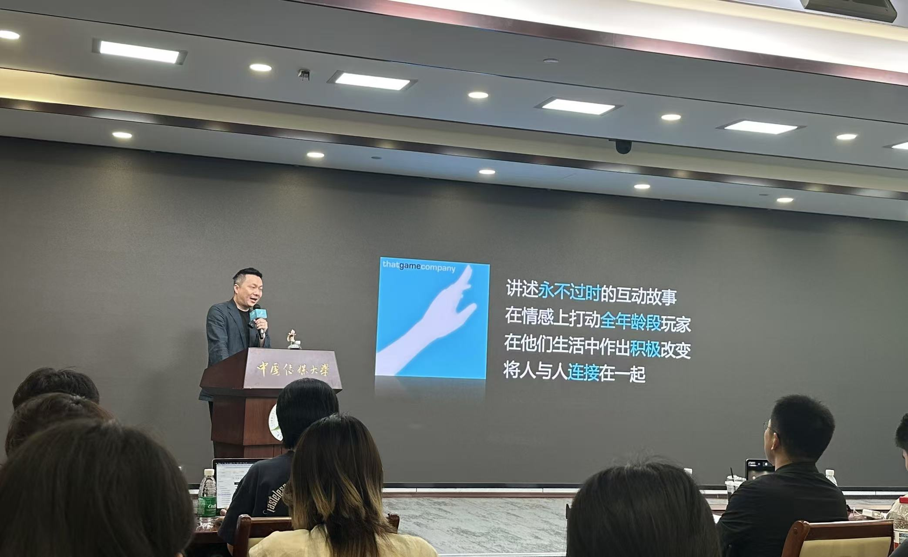
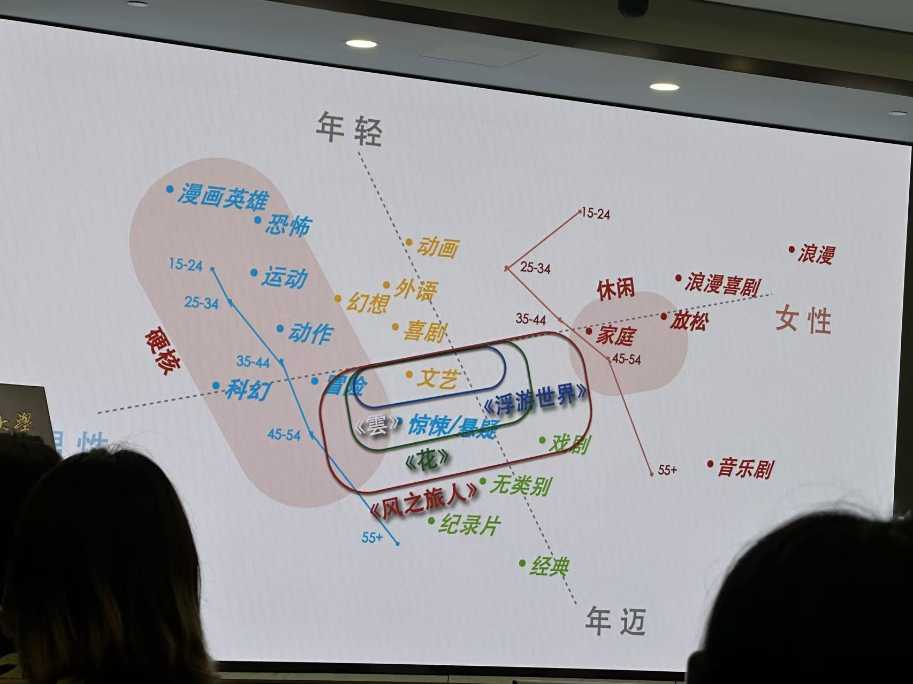

> 来源：
> 
> 中国传媒大学动画与数字艺术学院本科毕设联展
> 
> **那家游戏公司主题分享会**： 从互动中体会情感
> 
> **分享嘉宾**：《光遇》《风之旅人》制作人，那家游戏公司了，陈星汉
> 

很有趣，陈星汉作为男性设计出了《光遇》这样非乙女类的女性向游戏。这也许和他的硕士：[南加州大学电影艺术学院](https://zh.wikipedia.org/wiki/%E5%8D%97%E5%8A%A0%E5%B7%9E%E5%A4%A7%E5%AD%A6%E7%94%B5%E5%BD%B1%E8%89%BA%E6%9C%AF%E5%AD%A6%E9%99%A2 "南加州大学电影艺术学院")的互动媒体专业有些关系，他制作的游戏在我眼里更像艺术作品、禅意沙盒。

首先抛出的问题是，对于电影来说，同一年不同月份季节所偏爱的类型genre不同。在夏天，电影院线出现了更多的动作片，因为学生群体放暑假了，而青少年男性偏好动作片；在二月，电影院出现了更多的浪漫/爱情片，因为214情人节。然后是，不同性别不同年龄所偏爱的genre不同。非常好一张表（虽然是电影），这个里面的对立非常明显了，尤其是性别上的对立。就以游戏来说，使命召唤是最最男性化最靠左的那批，乙女游戏如恋与深空、换装游戏如奇迹暖暖则是最最女性化最靠右的那批，这些游戏是专门为某一性别的人打造的。但即使有些游戏不是就其性别贴身定制，也呈现出了明显的性别偏向，体育类游戏如FIFA、2K（不是专为某一性别打造，但几乎都是男玩家）模拟人生（同理，但几乎都是女玩家）。做到玩家性别比接近（或者说性别友好的），是Minecraft、原神、守望先锋、splatoon这种内核或设计至少有一个中性的游戏。

> Claude解释女性多的游戏强调"完成"和"幻想",男性多的强调"竞争"和"破坏",偏中性的强调“故事”,“创造",“发现”和"社群"。就算设计者主观上想做"无性别",玩家性别也可能偏——偏向来自文化和玩法,不来自设计者意图。最性别友好的游戏,不是靠"中立"或"讨好",而是靠主动删掉那些制造敌意与排斥的设计,把竞争换成合作、把摧毁换成创造、把炫耀换成表达

既然人的喜好这么难以统一，那么有没有可能做出一种游戏，不靠迎合某一类题材，而是在情感层面打动所有人？这是陈星汉想回答的根本问题，也是后面所有设计哲学的起点。（虽然但是，秉承着合作和全年龄性别适配的原则，《光遇》依旧偏向右上角也就是年轻女性，再次证明【设计者主观上想做"无性别",玩家性别也可能偏,偏向来自文化和玩法】） 

早期流行的**Power Fantasy（力量幻想）** 游戏，追求的是"胜利美学"，战斗、打怪、变强、成就感。陈星汉的转向正是对这个内核的反思：人一旦拥有力量，就倾向于使用力量、倾向于斗争；只有当人感到脆弱时，才会倾向于与他人合作。"感觉"——是渺小感和脆弱感本身，而非真的弱小（黑魂系就是制造这种脆弱感的例子）。顺着这个洞察，他的设计目标转向 与其给玩家力量，不如用打不死的强敌制造脆弱感，从而营造一个鼓励人互帮互助的环境。

### **陈星汉想讲怎样的故事？**

(1) 他想讲“反力量幻想”的故事，不是GTA这种“暴力即摧毁”，而是相反的“连接、创造与重建”，他想创造一个鼓励玩家互帮互助的游戏

(2) 就"戏剧"这个 tag 而言，不像科幻、悬疑那样靠外在题材一眼就能认出来，它的分类标准是内在的，即是否描述了一个人（或一群人）的成长与变迁，比如穷小子成为大富翁那样的人物弧线。正因为打动人的是"人的变化"而非题材，这样的故事才能跨年龄、跨文化。

### **陈星汉怎样讲故事？** 

叙事手法上，为了能跨越年龄和语言去打动人，他选择弱化文字、走禅意路线。文字被弱化之后，故事该怎么讲？（很多精品叙事类游戏极度依赖高质量的大量文本，比如极乐迪斯科）。用视听语言代替文字、游戏机制即叙事、"和玩家真人共处"本身做叙事。为了对抗现实游戏环境的毒性。网游聊天室戾气重，玩家社群充满恶意（2014年的Gamer Gate）。陈星汉的解法：在机制上直接禁止恶意互动，让玩家想坑人也坑不了（他举例说有玩家故意把其他玩家推下悬崖，见死不救还在尸体上跳舞，这是他不愿意看到的）；在设计上则引导玩家互助。

心流理论（Flow）贯穿了他的整条作品线。从早期的 Cloud（云），到 flOw（浮游世界，2007）、Flower（花，2009）、Journey（风之旅人，2012），再到后来转向服务型游戏的光遇（Sky），可以看作同一套理念不断演化、不断把"情感连接"做得更彻底的过程。

### 故事会

有人质疑 pay-to-win 会割裂普通玩家的情感体验，因为氪金玩家凌驾于普通玩家之上。陈星汉的回应是：让玩家通过社交和游戏进度获得的只是外观，目的是鼓励玩家表达个性，而不是炫耀优越感，从而营造一种脱离现实社会的"网络乌托邦"。

陈的早期作品主要在 Sony 平台，受众基本是男性玩家，而他做的又是全年龄向游戏，覆盖面受限。意识到这一点的他更换了平台。曾有影评人断言"电子游戏永远不能成为艺术"，但这一观点随着更多非常厉害的游戏作品而已被改变。但全世界对于游戏的偏见仍然存在，为电子游戏正名是一条漫长之路。

